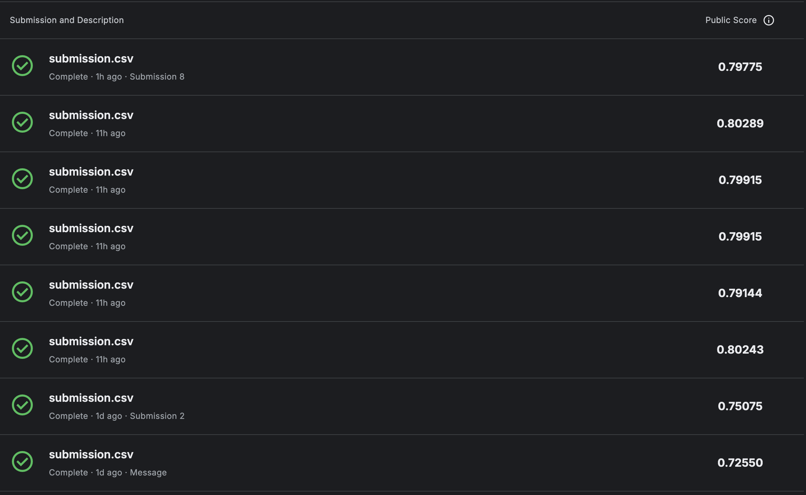

# Spaceship Titanic — Kaggle Competition

This repository contains a simple notebook and helper functions to participate in the "Spaceship Titanic" Kaggle competition. The goal is to predict whether a passenger was transported to another dimension based on passenger metadata and onboard spendings.

## What is included

- `main.ipynb` — an exploratory notebook that:
  - loads `data/train.csv` and `data/test.csv`
  - performs feature engineering (group extraction, cabin parsing, spendings aggregation, family features)
  - fills missing values using group/surname/cabin heuristics
  - trains a RandomForest model and writes `submission.csv`

- `requirements.txt` — Python dependencies used to run the notebook.

- `data/` — folder with `train.csv`, `test.csv` and `sample_submission.csv` (not included here for privacy).

- `kaggle_submissions.png` — screenshot of recent Kaggle submissions and public scores (embedded below).

## Kaggle submissions (public leaderboard snapshots)




## How to run

1. Create a Python environment and install the dependencies:

```bash
python -m venv .venv
source .venv/bin/activate
pip install -r requirements.txt
```

2. Start Jupyter and open `main.ipynb`:

```bash
jupyter notebook main.ipynb
```

3. Execute cells sequentially — the notebook includes data cleaning, feature creation and model training. The final cell produces `submission.csv`.

## Notes about the implementation

- Missing values are handled by a series of heuristics:
  - HomePlanet is filled using group majority, cabin deck rules, and surname majority.
  - Cabin deck/side/number are parsed and partially imputed from group or from similar passengers.
  - CryoSleep is inferred from `HasNotSpent` (passengers with zero spendings are likely in CryoSleep).
  - Spendings are filled: CryoSleep passengers get zero; others get median per group.

- The notebook includes a commented-out cross-validation simulation to estimate expected Kaggle accuracy using 5-fold CV.

## Reproducibility

- This repository was developed with the versions listed in `requirements.txt`. If you need a minimal set of packages to run the notebook, use the subset: `pandas`, `numpy`, `matplotlib`, `seaborn`, `scikit-learn`, `jupyter`.
